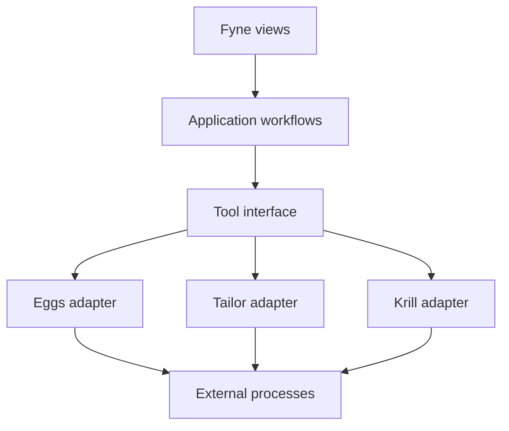
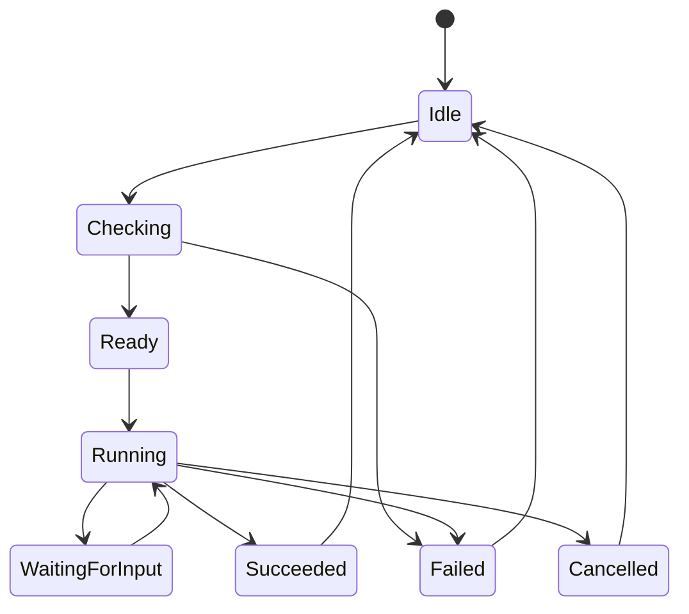

# Architecture

## Purpose

`penguins-gui` is an independent Fyne desktop application that orchestrates
external Penguins tools through their public command-line interfaces. It does
not import their packages or reproduce their domain logic.

The application must remain useful when only some tools are installed:

- Eggs remasters the running system;
- Tailor prepares and customizes it;
- Krill installs a live system;
- the GUI collects choices, requests authorization, starts operations and
  presents their progress and results.

The machine-readable contract is defined in [PROTOCOL.md](PROTOCOL.md). This
document describes how the GUI should be organized around that contract.

## Current prototype

The Fyne view remains in `main.go`, while `internal/tools/eggs.CLIAdapter`
owns the existing textual CLI integration. The adapter currently:

1. locates `eggs` in `PATH` and runs `eggs version`;
2. maps the selected mode to the existing `eggs remaster` flags;
3. elevates only the Eggs process with `pkexec`;
4. streams textual stdout and stderr into the Fyne window;
5. opens encrypted mode in a terminal because Eggs requests interactive input;
6. scans the working directory for the newest ISO after a successful exit.

This preserves the prototype's complete user journey. Command construction,
process execution and ISO discovery are isolated from Fyne; workflow coordination
and UI state remain in `main.go` for a later extraction. The name `CLIAdapter`
distinguishes this integration from the older Node.js Eggs version.

## Target layers



### Presentation

The presentation layer owns windows, widgets, dialogs, localization and visual
state. It renders application state and sends user intentions to a workflow.
It must not build command arguments, parse tool output or scan for artifacts.

Fyne updates must run through `fyne.Do`. Long-running operations must never
block the UI thread.

### Application workflows

A workflow coordinates one user goal, for example remastering:

1. discover the selected tool and its capabilities;
2. construct and validate a typed request;
3. run a non-destructive check when supported;
4. show the normalized plan and warnings;
5. obtain explicit confirmation where required;
6. start the operation;
7. reduce incoming events into application state;
8. expose the final result or structured error to the UI.

Workflows depend on interfaces, not concrete process implementations. This
allows testing with a fake tool that emits protocol fixtures.

### Tool interface

The application-facing interface should express behaviours rather than CLI
flags. A possible Go shape is:

```go
type Tool interface {
	Probe(ctx context.Context) (Capabilities, error)
	Check(ctx context.Context, request Request) (Plan, error)
	Run(ctx context.Context, request Request, events chan<- Event) (Result, error)
}
```

This is an architectural example, not a required public API. Eggs, Tailor and
Krill may have typed extensions for their own requests and inspection data.

### Tool adapters

Each external program has one adapter responsible for:

- executable discovery;
- mapping typed requests to its public CLI;
- privilege requirements;
- starting and supervising the child process;
- decoding JSON/NDJSON;
- translating legacy textual behaviour during migration;
- validating protocol versions and terminal results.

No tool-specific branching should escape into Fyne views.

## Suggested package layout

This is a direction for incremental refactoring, not a requirement to create
every package immediately:

```text
cmd/penguins-gui/        application entry point
internal/app/            workflows and application state
internal/domain/         requests, events, plans, results
internal/tools/          common process and protocol support
internal/tools/eggs/     Eggs adapter and legacy fallback
internal/tools/tailor/   Tailor adapter
internal/tools/krill/    future Krill adapter
internal/ui/             Fyne views and presentation models
protocol/                JSON Schemas and examples
pkg/builder/             native package builder
```

Refactoring should follow actual needs. The first extraction can be only the
Eggs adapter and remaster workflow.

## State model

One operation has a stable identity and a finite lifecycle:



The application state should contain at least:

- selected tool and operation;
- validated request and optional plan;
- `request_id` and `run_id`;
- lifecycle state;
- current step and progress;
- user-facing messages and retained diagnostic lines;
- warnings;
- final artifacts or structured error;
- whether cancellation is currently allowed.

The UI is a projection of this state. Buttons should not be enabled or disabled
by unrelated callbacks independently.

## Protocol and legacy adapters

The preferred Eggs adapter uses the JSON/NDJSON protocol. During migration it
may fall back to the current CLI after capability probing fails:

| Concern | Protocol adapter | Legacy adapter |
| --- | --- | --- |
| Availability | Capabilities document | `eggs version` |
| Progress | Structured NDJSON events | Plain combined log |
| Artifact | Final result document | Scan for a new ISO |
| Errors | Stable code and details | Exit code and text |
| Encrypted mode | Protected input channel | Separate terminal |

The fallback must be isolated and removable. New UI features should not depend
on parsing particular English log sentences.

## Process execution and privileges

The GUI itself normally runs unprivileged. Each adapter asks the tool through
its capabilities whether an operation requires elevation. On Linux the current
backend uses `pkexec`; alternative elevation backends can be added behind the
same process runner later.

Rules:

- pass arguments as an array, never through a shell command string;
- display a safely quoted representation separately from execution;
- propagate cancellation through `context.Context`;
- consume stdout and stderr concurrently;
- treat stdout as protocol-only in structured mode;
- bound retained logs to avoid unbounded memory use;
- never place passphrases in arguments, JSON, events or logs.

## Event processing

The adapter decodes every NDJSON line and validates its common envelope. The
application reducer then applies events in `sequence` order. It should reject
or report:

- unsupported protocol versions;
- mismatched `request_id` or `run_id`;
- decreasing or duplicated sequence numbers;
- a successful exit without a terminal result;
- a terminal success followed by additional events;
- malformed JSON on protocol stdout.

Unknown additive fields are ignored. Human-readable `message` values are never
used as control signals.

## Capability-driven UI

Controls are derived from the installed tool's capability document. Examples:

- hide or disable a remaster mode not reported by Eggs;
- show compression algorithms and level ranges reported by Eggs;
- enable Tailor dry-run only when supported;
- require confirmation when an operation is marked destructive;
- explain why a tool or operation is unavailable.

Version strings are displayed to the user but are not used to guess features.

## Error handling

Errors belong to three categories:

1. **GUI errors**: invalid local state, process start failure, protocol decoding
   failure;
2. **tool errors**: structured terminal errors returned by Eggs, Tailor or
   Krill;
3. **authorization errors**: elevation denied, unavailable or expired.

The main view shows a concise explanation and a possible remedy. Technical
details remain available in an expandable area and must be safe to copy.

## Testing strategy

Most GUI development should not require root or a real remaster:

- unit-test request construction and state reduction;
- test adapters with fixture-producing helper processes;
- validate all fixtures against the JSON Schemas;
- test cancellation, malformed output and missing terminal results;
- keep a small number of manual end-to-end tests on supported systems;
- use Eggs' own end-to-end infrastructure to validate actual ISO production.

The GUI tests the contract and presentation. Eggs, Tailor and Krill remain
responsible for testing their domain operations.

## Architectural invariants

1. Every tool remains independently usable from its CLI.
2. The GUI depends only on documented public interfaces.
3. Domain validation remains inside the tool that owns the operation.
4. The GUI never interprets private YAML, plans or working directories.
5. Structured identifiers drive logic; localized messages are presentation.
6. Privileges are requested per operation, not for the entire GUI.
7. AI assistance may prepare and explain requests but never bypass validation,
   authorization or explicit confirmation.
