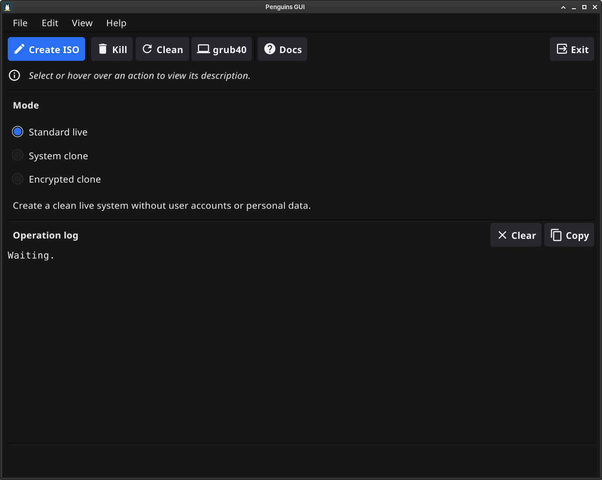

# penguins-gui

Minimal, independent desktop GUI for Penguins' Eggs.



See [CHANGELOG.md](CHANGELOG.md) for release notes.

The GUI starts Eggs remasters, displays live output, locates the resulting ISO
and provides access to common maintenance commands. It does not import Eggs
internals and does not modify Penguins' Eggs.

## Current scope

- Detect `eggs` in `PATH` and show its version in About.
- Select one of the three existing remaster modes:
  - standard live;
  - system clone (`--clone`);
  - encrypted clone (`--crypted`).
- Use `/home/eggs` as the working directory.
- Request administrative authorization through sudo or `pkexec`/polkit.
- Configure encrypted clones through a graphical passphrase dialog.
- Display live stdout and stderr, with Clear and Copy log actions.
- Find the newest ISO created directly in `/home/eggs`.
- Open the ISO directory with `xdg-open`.
- Run maintenance commands from menus and the action toolbar.
- Adjust font zoom and retain the preference between sessions.
- Prevent closing the GUI while an operation is running.

Krill, AI assistance, configuration editing and artifact management are
intentionally outside this first prototype.

Integration with Penguins Tailor is explicitly excluded: Tailor operates on
naked (headless/CLI) systems to prepare and customize them before a desktop
environment exists, making a graphical interface both impossible and unnecessary
for that stage.

## Requirements

- Linux desktop
- Go 1.25 or later
- Penguins' Eggs installed and available as `eggs`
- polkit with `pkexec` when the GUI is not already running as root
- `sudo` for the administrator-password dialogs used by clone modes
- For graphical encrypted clones, an Eggs version supporting `EGGS_LUKS_PASSPHRASE`
- Fyne build dependencies for the distribution

See the official Fyne documentation for the development packages required by
your distribution: <https://docs.fyne.io/started/>.

## Run during development

```bash
go mod tidy
go run .
```

## Test and build

```bash
go test ./...
go build -o penguins-gui .
```

The same operations are available as `make test`, `make build` and `make run`.

Do not launch the whole GUI with `sudo` for ordinary use. Only the external
command is elevated, through sudo or polkit.

## Known prototype limitations

- Eggs currently emits textual output, so the GUI shows a live log but not a
  reliable percentage progress bar.
- Graphical encrypted remastering requires Eggs support for the passphrase
  environment variable and uses its default crypto parameters.
- The final artifact is discovered by scanning for a recently modified `.iso`
  directly in `/home/eggs`.
- Closing the window is blocked while an operation is running; supervised cancellation is not yet available.
- The command shown in the log is informational and does not shell-escape paths;
  execution itself uses Go's argument-safe `exec.Command`, not a shell.
- Native packaging currently supports Debian, Arch Linux and Fedora families.

## Architectural rule

```text
penguins-gui -> eggs -> coa -> oa
```

Eggs remains fully usable without the GUI, and the GUI only consumes the public
command-line interface.

## Native packages (Debian, Arch and Fedora)

On Debian/Ubuntu/Devuan, Arch/Manjaro or Fedora, run as a normal user (no sudo):

```bash
make build
make package
```

The builder detects the package family from `/etc/os-release` (`ID`, then
`ID_LIKE`). Unsupported distributions produce an explicit error.

On Debian, packaging requires Git, `dpkg-dev` (including `dpkg-shlibdeps`) and the Fyne
build dependencies. `make package` rebuilds the GUI and writes a native `.deb`
to `dist/`. Cross-compilation is not supported by this packaging workflow.
The standalone Go builder uses only the standard library and has no dependency
on Penguins Tailor. Its staging/metadata/archive design and Git version rules
are adapted from Tailor's `pkg/builder`.

The package installs `/usr/bin/penguins-gui`, its desktop launcher and a scalable
SVG icon. Shared-library dependencies are calculated from the compiled binary
with `dpkg-shlibdeps`; `penguins-eggs`, `pkexec` and `xdg-utils` are also required
for the commands the GUI invokes. `sudo` is also a package dependency for clone
authentication dialogs.

Versioning follows Tailor: the nearest Git tag loses its leading `v`, and `-`
and `_` become dots. The Debian revision is the number of commits reachable
from HEAD but not from any tag, with zero replaced by one. Without tags, the
base version is `0.1.0` and the revision is the total HEAD commit count (or one
if Git cannot supply it). Uncommitted changes do not alter the version.

On Arch, install the build prerequisites:

```bash
sudo pacman -S --needed base-devel go git pkgconf libglvnd libx11 libxcursor libxrandr libxinerama libxi libxxf86vm libxkbcommon
make package
pacman -Qip dist/*.pkg.tar.zst
pacman -Qlp dist/*.pkg.tar.zst
```

Arch packaging uses a generated [PKGBUILD](https://man.archlinux.org/man/PKGBUILD.5.en)
and `makepkg`, producing `dist/penguins-gui-VERSION-REVISION-ARCH.pkg.tar.zst`.
As in Tailor, the recipe packages the staged native binary and desktop assets.
Runtime dependencies are recorded in the archive and checked by pacman at
installation; they need not be installed on the build host.
The shared staging step and separate distribution packagers allow additional
formats to be added later. The Git version rules apply to all three formats.

On Fedora, install the build prerequisites (Go 1.25 or later is required):

```bash
sudo dnf install golang git make gcc rpm-build redhat-rpm-config pkgconf-pkg-config libX11-devel libXcursor-devel libXrandr-devel libXinerama-devel libXi-devel libXxf86vm-devel mesa-libGL-devel libxkbcommon-devel wayland-devel
make package
rpm -qip dist/*.rpm
rpm -qlp dist/*.rpm
rpm -qp --requires dist/*.rpm
sudo dnf install ./dist/penguins-gui-*.rpm
```

Fedora packaging uses a generated RPM spec and `rpmbuild`, producing
`dist/penguins-gui-VERSION-REVISION.fc44.x86_64.rpm` on Fedora 44 x86_64
(the distribution suffix and architecture follow the build host; aarch64 is
also supported). RPM detects shared-library dependencies from the binary;
`penguins-eggs`, `polkit`, `sudo` and `xdg-utils` are explicit requirements.
Penguins' Eggs must be installed or available from a configured repository.
Like the other formats, this packages a locally built binary and is intended
for direct distribution, not submission to Fedora's official repositories.
The RPM currently records `LicenseRef-Unknown` because this repository has no
declared license; replace it when the project license is established.

`./m` cleans, builds and installs the native package with `sudo pacman -U`
`sudo dpkg -i` or `sudo dnf install`, following Tailor's convenience script.

Inspect the Debian archive before installing it:

```bash
dpkg-deb --info dist/*.deb
dpkg-deb --contents dist/*.deb
```

`make clean` removes the built binary and `dist/`. There is no `make install`;
`make package` only builds; `./m` also installs through the native package manager.

## Automated packages

The [Hammers workflow](.github/workflows/hammers.yml), adapted from
[Penguins Tailor](https://github.com/pieroproietti/penguins-tailor/blob/main/.github/workflows/hammers.yml),
runs on pushes and pull requests to `main`, on version tags, and can also be started manually
from GitHub Actions. It tests and builds a native amd64 `.deb` package in a Debian
Bookworm container, compatible with Debian (Bookworm and Trixie), Devuan, and Ubuntu,
using the Go version declared in `go.mod`. A separate Arch Linux job builds
and inspects the native x86_64 `.pkg.tar.zst` package. A Fedora 44 job builds
and inspects the x86_64 RPM, including its runtime dependencies.
Tests and packaging run as an unprivileged user; Fyne tests use a virtual display.

Download the package from the run's **Artifacts** section (`penguins-gui-debian-amd64`, `penguins-gui-arch-x86_64` or `penguins-gui-fedora-x86_64`).
Artifacts are retained for seven days. The workflow inspects package metadata and
contents; it does not install the package, since its `penguins-eggs` dependency
is not provided by the standard Debian repositories.

Version tags (`v*`) also publish a GitHub Release after the build succeeds, with
all three native packages and SHA256 checksums attached for permanent download.
